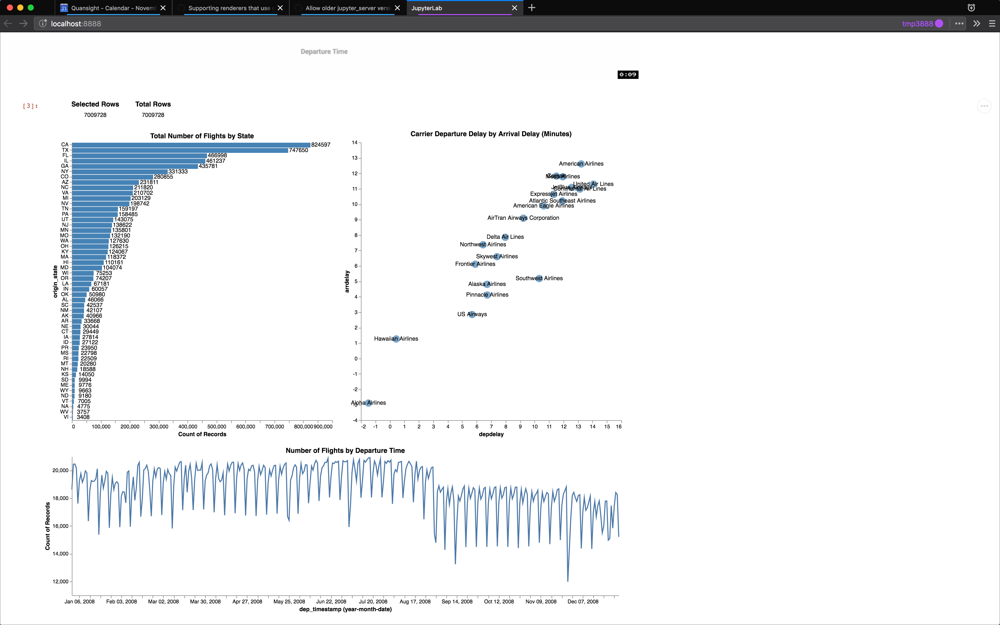

# ibis-vega-transform <br /> [](https://mybinder.org/v2/gh/Quansight/ibis-vega-transform/master?urlpath=lab/tree/examples/vega-compiler.ipynb) [](https://pypi.python.org/pypi/ibis-vega-transform) [](https://www.npmjs.com/package/ibis-vega-transform)

Python evaluation of Vega transforms using Ibis expressions.

For inspiration, see https://github.com/jakevdp/altair-transform

## Getting started

```sh
pip install ibis-vega-transform "tornado<6"
jupyter labextension install ibis-vega-transform
```

Then in a notebook, import the Python package and pass in an ibis expression
to a Altair chart:

```python
import altair as alt
import ibis_vega_transform
import ibis
import pandas as pd


source = pd.DataFrame({
    'a': ['A', 'B', 'C', 'D', 'E', 'F', 'G', 'H', 'I'],
    'b': [28, 55, 43, 91, 81, 53, 19, 87, 52]
})

connection = ibis.pandas.connect({'source': source })
table = connection.table('source')

alt.Chart(table).mark_bar().encode(
    x='a',
    y='b'
)
```

Check out the notebooks in the [`./examples/`](./examples/) directory to see
some options using interactive charts and the OmniSci backend.

### Dashboards

You can also create dashboards with this with Phoila.



```sh
pip install git+https://github.com/Quansight/phoila.git@comm_open "notebook<6.0"
phoila install ibis-vega-transform
phoila "examples/Charting Example.ipynb"
```

### Tracing

If you want to see traces of the interactiosn for debugging and performance analysis,
install tthe `jaeger-all-in-one` binary and the `jupyterlab-server-proxy-saulshanabrook`
lab extension to see the Jaeger icon in the launcher.

TheJjaeger server won't actually be started until a HTTP request is sent to it,
so before you run your visualization, click the "Jaeger" icon in the JupyterLab launcher or go to
`/jaeger` to open the UI. Then run your visualization and you should see the traces appear in Jaeger.

You also will likely have to increase the max UDP packet size on your OS to [accomdate for the large logs](https://github.com/jaegertracing/jaeger-client-node/issues/124#issuecomment-324222456):

```sh
# Mac
sudo sysctl net.inet.udp.maxdgram=200000
```

## Development

To install from source, run the following in a terminal:

```sh
git clone git@github.com:Quansight/ibis-vega-transform.git

cd ibis-vega-transform
conda env create -f binder/environment.yml
conda activate ibis-vega-transform

pip install -e .[dev]
jlpm
jupyter labextension install . --no-build


jupyter lab --watch
jlpm run watch
```

A pre-commit hook is installed usig Husky (Git > 2.13 is required!) to format files.

Run the formatting tools at any time using:

```sh
black ibis_vega_transform
jlpm run prettier
```

### Dashboards

You can create dashboards from notebooks by using Phoila:

```sh
# Need his PR https://github.com/vidartf/phoila/pull/11
pip install git+https://github.com/Quansight/phoila.git@comm_open "notebook<6.0"
phoila install .
phoila "examples/Charting Example.ipynb"
```

### Tracing

We are using [`jupyter-jaeger`](https://github.com/Quansight/jupyter-jaeger) to trace each interaction
for benchmarking.

## Releasing

First create a test environment:

```bash
conda create -n tmp -c conda-forge nodejs pip wheel twine
conda activate tmp
```

Then bump the Python version in `setup.py` and upload a test version:

```bash
rm -rf dist/
python setup.py sdist bdist_wheel
twine upload --repository-url https://test.pypi.org/legacy/ dist/*
```

Install the test version in your new environment:

```bash
pip install --index-url https://test.pypi.org/simple/ --extra-index-url https://pypi.org/simple ibis-vega-transform
```

Now bump the version for the Javascript package in `package.json`. The run a build,
create a tarball, and install it as a JupyterLab extension:

```bash
yarn run build
yarn pack --filename out.tgz
jupyter labextension install out.tgz
```

Now open JupyterLab and run through all the notebooks in `examples` to make sure
they still render correctly.

Now you can publish the Python package:

```bash
twine upload dist/*
```

And publish the node package:

```bash
npm publish out.tgz
```

And add a git tag for the release and push:

```bash
git tag <new version>
git push
git push --tags
```
